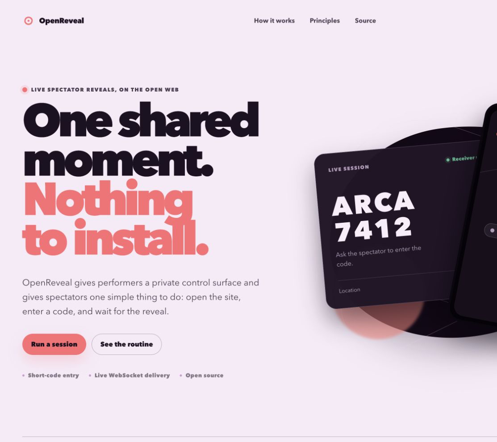
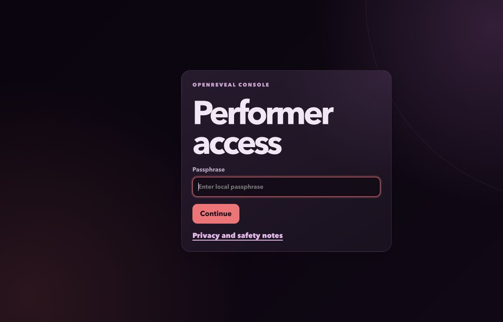
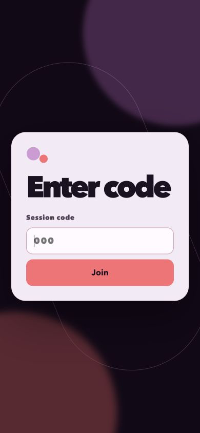
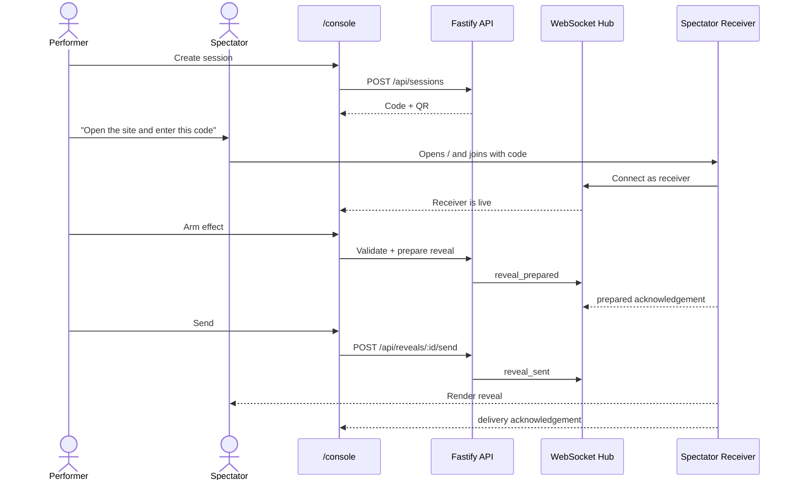
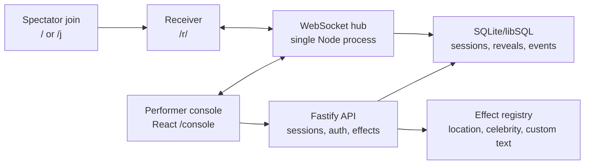

# OpenReveal

[](https://github.com/boonyongyang/openreveal/actions/workflows/ci.yml)
[](LICENSE)
[](https://nodejs.org)

OpenReveal is an open-source, consent-based spectator-phone mentalism PWA. A performer creates a live session, asks a spectator to open the site and enter a short code, and controls an original reveal page from a private console.

The v0.1 build is designed as one clean routine flow: the performer works from `/console`, the spectator opens the short site, enters the code, waits on a neutral screen, and sees the reveal only when the performer sends it.

## Live Project

- Public front door: [openreveal.web.app](https://openreveal.web.app)
- Performer console: [openreveal.web.app/console](https://openreveal.web.app/console)
- First release: [v0.1.0](https://github.com/boonyongyang/openreveal/releases/tag/v0.1.0)

The Firebase front door redirects to the Cloud Run service on the same path. That is intentional: WebSocket traffic stays on Cloud Run, where the backend session hub lives.

## Visual Tour

The public story, private console, and spectator entry are deliberately different surfaces. The performer gets clear controls; the spectator gets one action and no distracting navigation.

**Public landing**



**Performer access**



**Spectator entry**



## How it works



1. **Create** - the performer opens the private console and starts a session, which produces a grouped session code and QR backup.
2. **Join** - the spectator opens the site root or `/j`, enters the code, and is moved into `/r/<code>` with history replacement so Back does not return to the join form.
3. **Prepare** - the performer selects an effect, fills the payload, and arms it. The backend validates and stores the prepared reveal.
4. **Send** - the performer sends the reveal. The receiver renders it over the live WebSocket and reports delivery latency back to the console.
5. **Reset or end** - reset returns the spectator to the neutral waiting screen; end shows a plain inactive-session message.

Nothing is shown on the spectator phone until the performer sends it, and the
performer only ever controls pages served by this project. See the
[Safety Boundary](#safety-boundary).

## Features

- **Live two-device sessions** over WebSocket, with reconnect and a liveness reaper.
- **Built-in reveals**: location (Google Maps link, with a manual fallback when no Places key is set), celebrity (text-only, auditable preset metadata), and custom text.
- **Private performer console**: Quick Session for routine performance, Advanced mode for diagnostics, direct receiver URL, demo mode, logs, and preset import/export.
- **Consent-first by design**: spectators opt in by opening a URL and entering a code; no spectator data is collected or stored centrally.
- **Hardened**: per-IP and per-route rate limiting, constant-time passphrase check, anonymous-WebSocket abuse controls, CSP/HSTS/anti-framing headers, and an Origin/Referer CSRF guard. Exercised in CI on every push (see [SECURITY.md](SECURITY.md)).
- **Self-hostable**: single-host Cloud Run friendly, with documented local and production setup.

## Architecture At A Glance



V1 intentionally runs as a single backend instance. The WebSocket hub and abuse counters are in memory, while SQLite stores sessions, reveal payloads, receiver records, and event history. For the current hosted reference instance, SQLite is demo-grade container storage; use durable libSQL/Turso, Cloud SQL, or another managed database before relying on long-term history.

## Stack

- Node 22.12+
- pnpm workspaces
- Vite + React + TypeScript
- Fastify + `@fastify/websocket`
- SQLite via Drizzle + libsql
- TypeBox/Ajv schemas
- Vitest and Playwright

## First Run

Use Node 22.12 or newer and pnpm 10.10.0. If you use `nvm`, the repository's
`.nvmrc` selects the CI baseline:

```sh
nvm use
npm install --global pnpm@10.10.0 # only when pnpm 10 is not already installed
cp .env.example .env
pnpm install --frozen-lockfile
pnpm dev
```

Open the performer console at [http://localhost:5173/console](http://localhost:5173/console). Spectators use [http://localhost:5173/](http://localhost:5173/) or `/j` to enter the session code. The passphrase is the value of `PERFORMER_PASSPHRASE` in `.env`.

For a full walkthrough, see [STARTER-GUIDE.md](STARTER-GUIDE.md). For the focused desktop and same-Wi-Fi phone workflow, see [docs/local-testing-setup.md](docs/local-testing-setup.md).

## Screenshots And Recordings

The committed visuals are generated from the real app flow:

```sh
pnpm screenshots                 # capture the committed README stills
```

For full synchronized performer/audience video walkthroughs (MP4s are generated on
demand, not committed):

```sh
pnpm record:showcase             # full performer + audience QA walkthrough
pnpm record:location-celebrity   # focused location + celebrity reveals
```

Outputs are written to `test-results/showcase/` and
`test-results/location-celebrity/`. See [docs/testing-plan.md](docs/testing-plan.md)
for what each recording covers.

## Commands

```sh
make help
make dev
make check
make test-e2e
make docker-build
```

The full command reference is in [COMMANDS.md](COMMANDS.md). Equivalent pnpm scripts are available through `pnpm dev`, `pnpm lint`, `pnpm test`, `pnpm test:e2e`, `pnpm typecheck`, `pnpm build`, and `pnpm check`.

For production self-hosting, see [docs/production-deployment.md](docs/production-deployment.md).
For deployment testing, see [docs/testing-plan.md](docs/testing-plan.md).

## Safety Boundary

OpenReveal only controls pages served by this project. It must not clone third-party products, collect private spectator data, spoof device interfaces, or access anything on a spectator phone outside the page they intentionally opened.

See [requirements/safety-and-legal.md](requirements/safety-and-legal.md) for the review checklist.

## Contributing

Read [CONTRIBUTING.md](CONTRIBUTING.md) before opening issues or pull requests. New effects should follow [docs/effect-authoring.md](docs/effect-authoring.md), and preset/asset work should follow [docs/routine-pack-licensing.md](docs/routine-pack-licensing.md).

By participating you agree to the [Code of Conduct](CODE_OF_CONDUCT.md). To report a security vulnerability, follow the [Security Policy](SECURITY.md). Do not open a public issue.

## Planning Docs

- [STARTER-GUIDE.md](STARTER-GUIDE.md)
- [COMMANDS.md](COMMANDS.md)
- [CONTRIBUTING.md](CONTRIBUTING.md)
- [PHASED-TASKS.md](PHASED-TASKS.md)
- [plan.md](plan.md)
- [docs/architecture.md](docs/architecture.md)
- [docs/cloud-run-deployment.md](docs/cloud-run-deployment.md)
- [docs/local-testing-setup.md](docs/local-testing-setup.md)
- [docs/effect-authoring.md](docs/effect-authoring.md)
- [docs/preset-format.md](docs/preset-format.md)
- [docs/testing-plan.md](docs/testing-plan.md)
- [docs/deployment-readiness.md](docs/deployment-readiness.md)
- [docs/build-suggestions.md](docs/build-suggestions.md)
- [requirements/product-requirements.md](requirements/product-requirements.md)
- [requirements/technical-requirements.md](requirements/technical-requirements.md)
- [requirements/setup-requirements.md](requirements/setup-requirements.md)
- [requirements/safety-and-legal.md](requirements/safety-and-legal.md)
- [requirements/owner-inputs.md](requirements/owner-inputs.md)
- [docs/routine-pack-licensing.md](docs/routine-pack-licensing.md)
- [docs/production-deployment.md](docs/production-deployment.md)
- [STATUS.md](STATUS.md)
