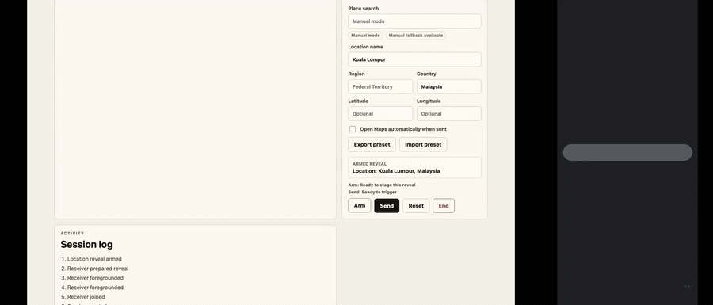
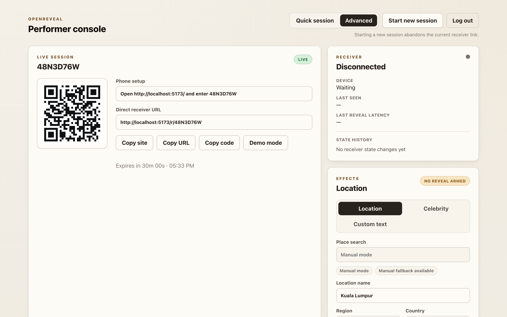
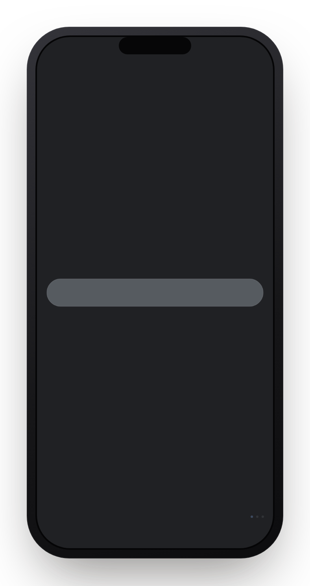
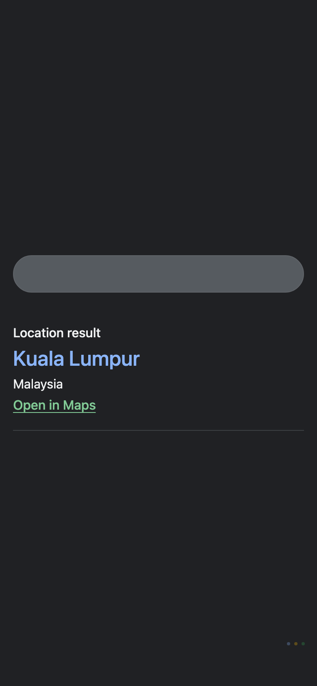
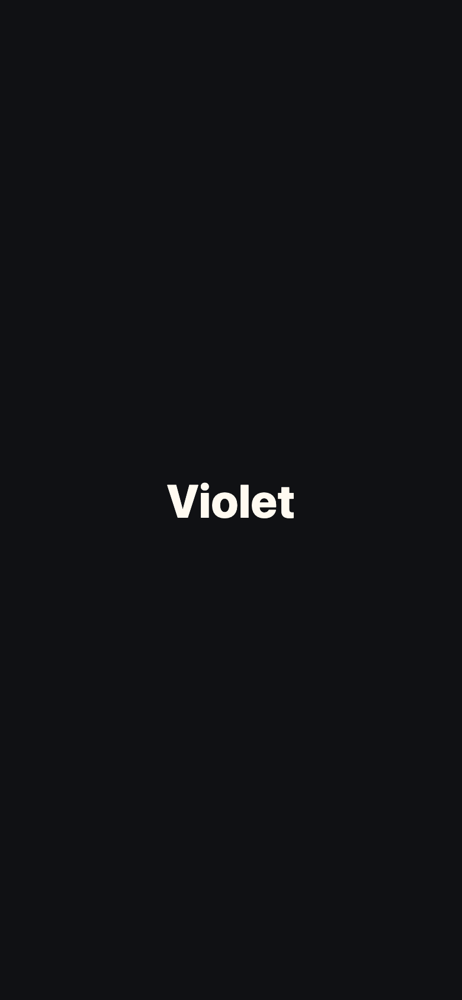
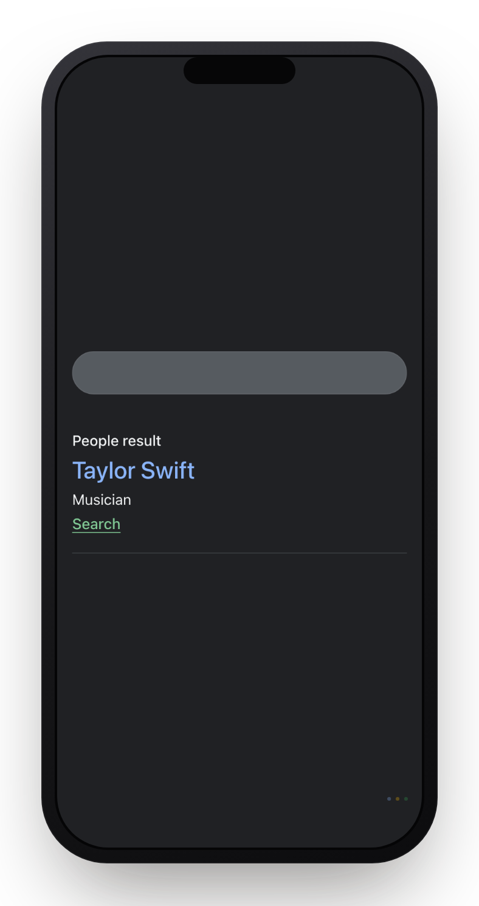

# OpenReveal

OpenReveal is an open-source, consent-based spectator-phone mentalism PWA. A performer creates a live session, asks a spectator to open the site and enter a short code, and controls an original reveal page from a private console.

The current build implements the live session foundation plus location reveal, text-only celebrity reveal with auditable preset metadata, and a Phase 6 custom text reveal. The performer console can create a session, open demo mode, arm any built-in effect, send it to the spectator receiver page, receive delivery acknowledgements, and reset the session.

## Stack

- Node 22.12+
- pnpm workspaces
- Vite + React + TypeScript
- Fastify + `@fastify/websocket`
- SQLite via Drizzle + libsql
- TypeBox/Ajv schemas
- Vitest and Playwright

## First Run

```sh
cp .env.example .env
pnpm install
pnpm dev
```

Open the performer console at [http://localhost:5173/console](http://localhost:5173/console). Spectators use [http://localhost:5173/](http://localhost:5173/) or `/j` to enter the session code. The passphrase is the value of `PERFORMER_PASSPHRASE` in `.env`.

For a full walkthrough, see [STARTER-GUIDE.md](STARTER-GUIDE.md). For the focused desktop and same-Wi-Fi phone workflow, see [docs/local-testing-setup.md](docs/local-testing-setup.md).

## Demo

The performer drives a private console; the spectator sees only a clean reveal on
their own phone. Left = performer console, right = the spectator's phone, in sync:



> There is no hosted public demo — OpenReveal is meant to be run locally or
> self-hosted (it keeps the project free to maintain and avoids holding any
> spectator data centrally). It runs in ~2 minutes locally, see
> [First Run](#first-run).

**Performer console** (desktop)



**Spectator phone** (standby → location, custom text, and celebrity reveals)

| Standby | Location | Custom text | Celebrity |
| --- | --- | --- | --- |
|  |  |  |  |

These stills are committed under `docs/screenshots/` and regenerated from the real
app flow with:

```sh
pnpm screenshots                 # capture the committed README stills
```

For full synchronized performer/audience video walkthroughs (MP4s are generated on
demand, not committed):

```sh
pnpm record:showcase             # full performer + audience QA walkthrough
pnpm record:location-celebrity   # focused location + celebrity reveals
```

Outputs are written to `test-results/showcase/` and
`test-results/location-celebrity/`. See [docs/testing-plan.md](docs/testing-plan.md)
for what each recording covers.

## Commands

```sh
make help
make dev
make check
make test-e2e
make docker-build
```

The full command reference is in [COMMANDS.md](COMMANDS.md). Equivalent pnpm scripts are available through `pnpm dev`, `pnpm lint`, `pnpm test`, `pnpm test:e2e`, `pnpm typecheck`, `pnpm build`, and `pnpm check`.

For production self-hosting, see [docs/production-deployment.md](docs/production-deployment.md).
For deployment testing, see [docs/testing-plan.md](docs/testing-plan.md).

## Safety Boundary

OpenReveal only controls pages served by this project. It must not clone third-party products, collect private spectator data, spoof device interfaces, or access anything on a spectator phone outside the page they intentionally opened.

See [requirements/safety-and-legal.md](requirements/safety-and-legal.md) for the review checklist.

## Contributing

Read [CONTRIBUTING.md](CONTRIBUTING.md) before opening issues or pull requests. New effects should follow [docs/effect-authoring.md](docs/effect-authoring.md), and preset/asset work should follow [docs/routine-pack-licensing.md](docs/routine-pack-licensing.md).

By participating you agree to the [Code of Conduct](CODE_OF_CONDUCT.md). To report a security vulnerability, follow the [Security Policy](SECURITY.md) — do not open a public issue.

## Planning Docs

- [STARTER-GUIDE.md](STARTER-GUIDE.md)
- [COMMANDS.md](COMMANDS.md)
- [CONTRIBUTING.md](CONTRIBUTING.md)
- [PHASED-TASKS.md](PHASED-TASKS.md)
- [plan.md](plan.md)
- [docs/architecture.md](docs/architecture.md)
- [docs/cloud-run-deployment.md](docs/cloud-run-deployment.md)
- [docs/local-testing-setup.md](docs/local-testing-setup.md)
- [docs/effect-authoring.md](docs/effect-authoring.md)
- [docs/preset-format.md](docs/preset-format.md)
- [docs/testing-plan.md](docs/testing-plan.md)
- [docs/deployment-readiness.md](docs/deployment-readiness.md)
- [docs/build-suggestions.md](docs/build-suggestions.md)
- [requirements/product-requirements.md](requirements/product-requirements.md)
- [requirements/technical-requirements.md](requirements/technical-requirements.md)
- [requirements/setup-requirements.md](requirements/setup-requirements.md)
- [requirements/safety-and-legal.md](requirements/safety-and-legal.md)
- [requirements/owner-inputs.md](requirements/owner-inputs.md)
- [docs/routine-pack-licensing.md](docs/routine-pack-licensing.md)
- [docs/production-deployment.md](docs/production-deployment.md)
- [STATUS.md](STATUS.md)
