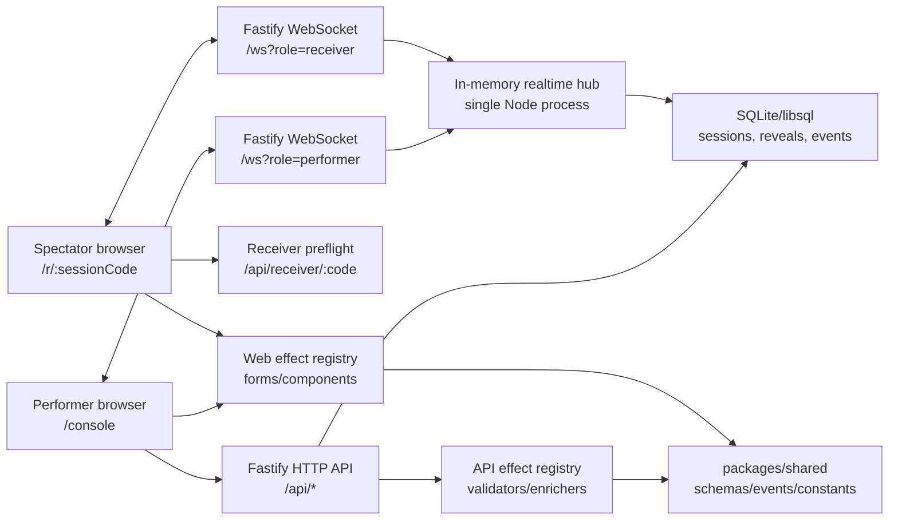

# Architecture

OpenReveal v1 is a single-instance PWA with a Node/Fastify backend, WebSocket realtime layer, and SQLite persistence.

## Product Mental Model

OpenReveal has two surfaces:

- **Performer console**: authenticated control room at `/console`.
- **Spectator receiver**: minimal phone surface at `/`, `/j`, then `/r/:sessionCode`.

The spectator does not receive a direct link as the primary routine. The intended performance path is easier: open the short domain, enter the code, wait, then receive the reveal.

```mermaid
flowchart TD
  root["/ or /j\nJoin page"] --> code["Enter session code"]
  code --> receiver["/r/:sessionCode\nNeutral waiting screen"]
  receiver --> reveal["Reveal appears only after Send"]
  receiver --> reset["Reset returns to waiting"]
  receiver --> end["End shows inactive session"]
```

## System Diagram



## Request Flow

### Session Creation

1. Performer logs in at `/console`.
2. API validates `PERFORMER_PASSPHRASE` and mints an HttpOnly SameSite cookie.
3. Performer creates a session.
4. API stores the session in SQLite and returns the grouped code, receiver URL, and QR SVG.
5. Quick Session shows the code, QR fallback, receiver status, effect picker, and `Arm` / `Send` / `Reset` / `End`.

### Spectator Join

1. Spectator opens `/` or `/j`.
2. Spectator enters the session code.
3. The web app uses `window.location.replace("/r/<code>")` so browser Back does not return to the join form.
4. Receiver checks `/api/receiver/:code`.
5. Receiver opens a WebSocket if the session is live and available.
6. Performer console receives the receiver state update.

### Reveal Delivery

1. Performer arms an effect through HTTP.
2. API validates/enriches the payload, stores it, and sends `reveal_prepared` to the receiver.
3. Receiver caches the payload and sends `receiver.prepared_ack`.
4. Performer sends the reveal through HTTP.
5. API emits `reveal_sent`.
6. Receiver renders the cached payload and sends `receiver.reveal_ack` with latency.
7. Performer console shows delivered state and latest render latency.

### Reset And End

1. `Reset` clears the active reveal and returns the receiver to the neutral waiting screen.
2. `End` retires the session and disables performer mutation controls.
3. Ended or expired sessions render only a plain inactive-session message for spectators.

## Persistence

SQLite stores:

- sessions
- reveal payloads
- receiver device records
- session events

The WebSocket hub keeps only live connection state in memory. This is why v1 must run as one backend instance.

## Reconnect Model

- Receiver stores a browser-local device id per session.
- A reconnect with the same device id can replace a stale socket.
- A different device remains `in_use` while the original receiver is active.
- If the receiver reconnects after a reveal was sent, the API restores the active reveal from SQLite and replays the latest state.

## Effect Boundary

Effects are split across:

- `packages/shared`: schemas, effect kinds, event contracts.
- `apps/api`: validators, enrichers, persistence payload generation.
- `apps/web`: performer forms and spectator reveal components.

Core session, auth, realtime, and persistence code should not branch on effect-specific details.

## Production Shape

Supported v1 production:

- one Node process
- one SQLite/libsql database on persistent disk
- one WebSocket hub in memory
- optional static serving from `WEB_DIST_DIR`
- HTTPS reverse proxy in front

Out of scope for v1:

- multiple backend instances
- Redis/pub-sub fanout
- Postgres
- native mobile apps
- account systems
- image upload/storage pipelines

## Hosted Reference Shape

The current reference deployment uses:

- Firebase Hosting at `https://openreveal.web.app` as a same-path redirector.
- Cloud Run as the actual Node/API/WebSocket origin.
- Secret Manager for `SESSION_SECRET` and `PERFORMER_PASSPHRASE`.
- Cloud Run max instances set to `1`.
- Container-local SQLite for demo-grade storage.

That shape is reliable enough for portfolio and controlled demo use. It is not a durable multi-tenant production architecture because session history can be lost across redeploys, restarts, or instance replacement.
