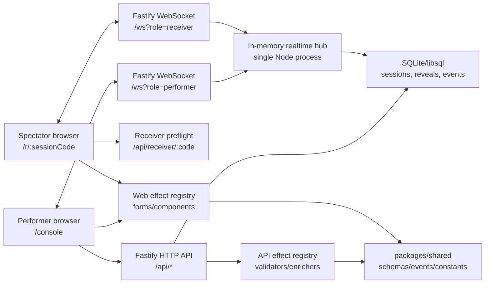

# Architecture

OpenReveal v1 is a single-instance PWA with a Node/Fastify backend, WebSocket realtime layer, and SQLite persistence.

## System Diagram

## Request Flow

1. Performer logs in at `/console`.
2. API validates `PERFORMER_PASSPHRASE` and mints an HttpOnly SameSite cookie.
3. Performer creates a session.
4. API stores the session in SQLite and returns the receiver URL plus QR SVG.
5. Spectator opens `/r/:sessionCode`.
6. Receiver checks `/api/receiver/:code` and opens a WebSocket if live.
7. Performer arms an effect through HTTP.
8. API validates/enriches the payload, stores it, and sends `reveal_prepared` to the receiver.
9. Receiver caches the payload and sends `receiver.prepared_ack`.
10. Performer sends the reveal through HTTP.
11. API emits `reveal_sent`.
12. Receiver renders the cached payload and sends `receiver.reveal_ack` with latency.
13. Performer console shows delivered state and latest render latency.

## Persistence

SQLite stores:

- sessions
- reveal payloads
- receiver device records
- session events

The WebSocket hub keeps only live connection state in memory. This is why v1 must run as one backend instance.

## Reconnect Model

- Receiver stores a browser-local device id per session.
- A reconnect with the same device id can replace a stale socket.
- A different device remains `in_use` while the original receiver is active.
- If the receiver reconnects after a reveal was sent, the API restores the active reveal from SQLite and replays the latest state.

## Effect Boundary

Effects are split across:

- `packages/shared`: schemas, effect kinds, event contracts.
- `apps/api`: validators, enrichers, persistence payload generation.
- `apps/web`: performer forms and spectator reveal components.

Core session, auth, realtime, and persistence code should not branch on effect-specific details.

## Production Shape

Supported v1 production:

- one Node process
- one SQLite/libsql database on persistent disk
- one WebSocket hub in memory
- optional static serving from `WEB_DIST_DIR`
- HTTPS reverse proxy in front

Out of scope for v1:

- multiple backend instances
- Redis/pub-sub fanout
- Postgres
- native mobile apps
- account systems
- image upload/storage pipelines
